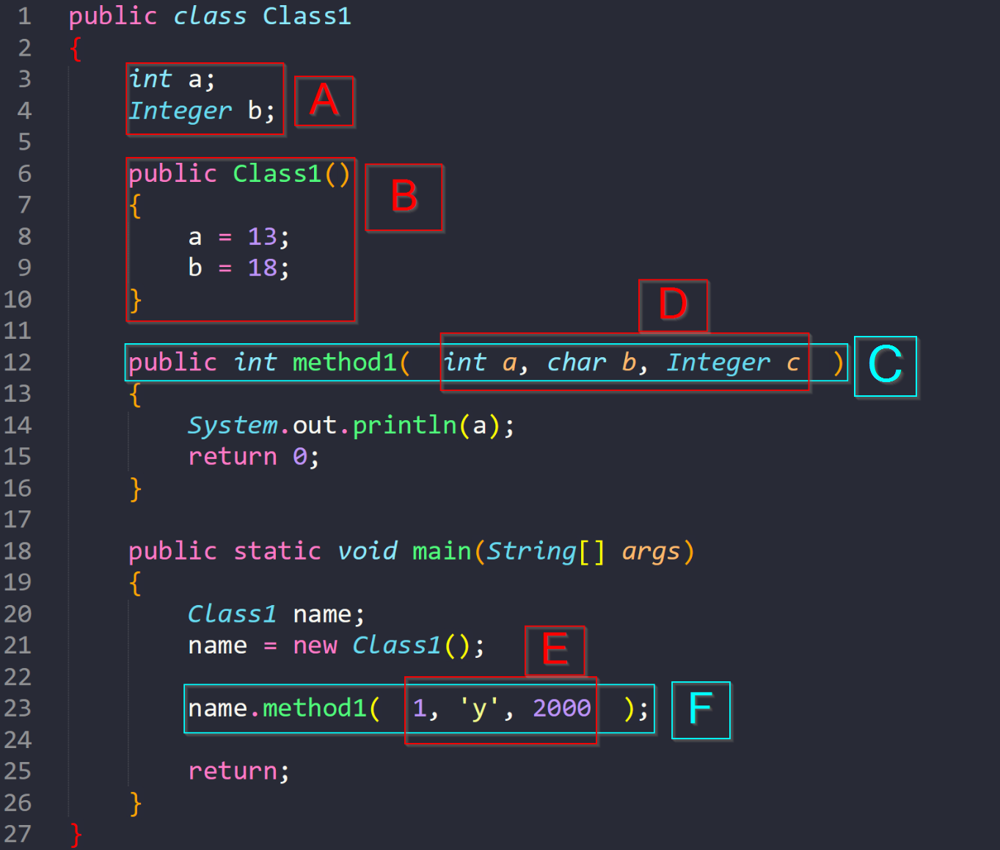

# PSA0: Introduction

## Welcome to CSE 8B!
The purpose of this assignment, since we will have only one lecture before it is due, will be to outline our policies and expectations, setup our programming environment, solve a simple coding exercise in Java, and get familiar with assignment submission. 

### Policies and expectations
1. In this course, we will have a problem-solving assignment, mostly programming, each week. Requirements for these assignments will be in "writeups", such as this one. If there is ever a discrepancy between provided files and the writeup, follow the writeup. 
2. We will use [Piazza](https://piazza.com/class "Piazza homepage") for announcements and clarifications. Although it is not required that you read every post, you are expected to check it for important information such as due dates, revised starter files, etc. 
3. Before asking a question on Piazza, try to do a search for it using the search bar. For duplicate questions, we will follow the precedent set by the previous instructor answer; in the case of an inconsistency between Piazza answers to the same question or between a Piazza answer and the writeup, please ask for clarification (in a new post for a faster response). 
4. Do not pretend to be an instructor. Instructors are not able to post anonymously. Furthermore, note that a student may have a badge indicating that they are an instructor-endorsed answerer. This does not mean anything; unless the student answer is marked as a good question by an instructor, we have not endorsed it. 
5. Do not post code in public posts. This is a violation of academic integrity. If you accidentally do this, make all efforts to remove the code and ask the instructor to make the post private. 
6. Follow academic integrity. Do not use a solution that you find on the internet. Looking up documentation, syntax, or an example for how to use some function is allowed. On the flipside, do not post your code for this class to the internet. If you are using GitHub or a similar service, make sure your code is in a private repository. You can do this for free with the [GitHub education pack](https://education.github.com/pack "GitHub education pack website"). 
7. Do not use any libraries that are not java.lang or java.util unless explicitly allowed (if you are not sure, you can ask on Piazza in a public post). Similarly, do not use any libraries or functions that are explicitly disallowed. 
7. Assignments will be submitted via [Gradescope](https://www.gradescope.com/ "Gradescope homepage"). Exam grades will also be released via Gradescope. 
8. Only use the regrade request functionality if you believe a rubric item was incorrectly applied or there is a mistake in the rubric. If you submit a regrade request, we will regrade some undefined portion of the assignment (so if we incorrectly awarded points the first time, you may not be awarded those points again). 
9. If you are asking for clarification about some rubric item but not requesting a regrade (yet), please ask via a Piazza private post. As long as you submit this post before the regrade deadline ends, we will still regrade the assignment after the regrade period ends, if needed. 
10. Your code will be graded as it works on ieng6, therefore you should always test your code on ieng6 prior to submission. 
11. Tutor hours will be posted on the course calendar. If your ticket is still in the [Autograder](https://autograder.ucsd.edu/ "Autograder homepage") queue after tutor hours are over, the tutor(s) may not be able to help you. 
12. If you need to leave the location specified in your Autograder ticket, please write when you will be back in the comments of the ticket. If you are not there at the time the ticket is accepted, the tutor may either return your ticket to the queue as a low-priority ticket or cancel the ticket if you do not leave a comment. 
13. Make sure you've read [Grading Policies](https://sites.google.com/eng.ucsd.edu/cse-8b/syllabus/grading-policies) on how we grade, what is academic integrity (what counts as cheating), and what is [professionalism](https://sites.google.com/eng.ucsd.edu/cse-8b/syllabus/professionalism). Also understand how [regrade requests](https://sites.google.com/eng.ucsd.edu/cse-8b/programming-assignments/regrade-requests) work. CSE 8B will move fast so learn to [ask for help](https://sites.google.com/eng.ucsd.edu/cse-8b/programming-assignments/how-to-do-well). Make sure you have read all the pages of the [syllabus](https://sites.google.com/eng.ucsd.edu/cse-8b/syllabus). 
14. You are **required** to sign the Academic Integrity Form electronically after completing the [Academic Integrity Tutorial](http://libraries.ucsd.edu/assets/elearning/cse/cseplagiarismlink/story_html5.html "AI Tutorial Link"). The form can be found [here](https://docs.google.com/forms/d/e/1FAIpQLSd_MyRyWcwDKB6K_uXSBYjzFun0T0ffL21ObzM386qfB6cpHQ/viewform "CSE 8B AI Form").

## 0. Extra Credit Reminder
You can earn 0.2% of the overall grade by filling out [CS Experience Survey](https://forms.gle/8xzgHVhce7qVywr99 "CSE 8B Pre-class Survey") by the **end of week 1**.

## 1. Programming Requirements for CSE 8B
The Java code you submit in the programming assignments must compile and run on Java 10 on Linux. If you use the lab machines in the CSE building, then you should be using the correct programming language version and the correct operating system version by default. We'll confirm the compiler version as part of this assignment. In-lab and remote programmers will use the correct compiler and operating system by default, since your connection allows you access to data and programs on the lab machines. Local programmers have additional problems and must check their Java programs against ieng6. 
To earn credit, your Java code must be for
- Programming Language: Java 10
- Operating System: Linux/UNIX
For example, if you use Java for Windows and a program produces a file that has the wrong formatting, which is possible, points will be lost and that case is not eligible for regrades. This is why programs must be checked against the ieng6 servers.

## 2. Using the Shell
Shells are where you type commands to accomplish many tasks. The terminal can spawn a shell. SSHing can spawn a shell. A Windows 10 shell can spawn a UNIX shell. 
For additional info: 
- [Wiki for Shell Computing](https://en.wikipedia.org/wiki/Shell_(computing))
- [Wiki for Gnome Terminal](https://en.wikipedia.org/wiki/GNOME_Terminal)
- [Wiki for terminal](https://en.wikipedia.org/wiki/Terminal_(macOS))

Each of the following are ways to program. You don't need to know all of it. We just want to warn those desiring to program locally on their computers directly the risks/configurations needed. 

### Login Info 
Find out your login info with the [ETS Account Lookup Tool](https://sdacs.ucsd.edu/~icc/index.php). 
It should be a `cs8bfa19__` account. The account password is the same as your regular TritonEd password. However, it's possible that you don't have this account. If that's the case, use your email username. Upon logging in, type `prep cs8bfa19`. This prepping command is not needed for `cs8bfa19__` accounts.

If you are unable to login using the username and your password either in-lab or remotely, you may need to reset your password for your cs8b account at the above link or contact ETS to get it fixed. 

### Programming In-Lab
You may choose to work on the assignments in-lab. Find a computer in the CSE Basement and then login (to your `cs8bfa19` account). To open a Terminal, right click the desktop or within the file explorer and press "Open in Terminal". That will spawn a new shell for you.

### Programming Remotely
If you choose to program remotely (not directly on the lab computers), you can SSH into the lab machines. SSH allows you to access the ieng6 machines and use the shell on the ieng6 servers to work on your assignments. For UNIX machines, you can do so in the terminal with the following command: 
```bash
ssh -X cs8bfa19__@ieng6.ucsd.edu
```
where `cs8bfa19__` should be your account. 
For Mac users, you may need to replace -X with -Y. This enables X11 Forwarding, which is required for graphical data like windows. However, Macs don't have X11 by default. Download XQuartz and install it. Restart your computer, launch XQuartz, and SSH in.

<a href="http://www.youtube.com/watch?feature=player_embedded&v=5ge1UrdZu0g
" target="_blank"></a>
<a href="http://www.youtube.com/watch?feature=player_embedded&v=x--J2WdSdGE
" target="_blank"></a>

For Windows users, you may want to try downloading and installing MobaXTerm, which is a very convenient SSH client program. It comes with the networking protocols to both use the remote shell and to transfer files between your local Windows machine and the ieng6 lab machines. This program also takes care of X11 forwarding automatically. 

<a href="http://www.youtube.com/watch?feature=player_embedded&v=LoGecCoNBys
" target="_blank"></a>
<a href="http://www.youtube.com/watch?feature=player_embedded&v=jdGHRLS6uIQ
" target="_blank"></a>

(Optional) You may also want to see the entire Linux desktop remotely. The above provides individual windows only. To see the graphical desktop, Windows users can download VNCViewer. Mac has VNC built in. See:
https://acms.ucsd.edu/info/vncgnome.html \
We also have our own tutorial about using vncgnome [here](https://docs.google.com/document/d/1i_rg4RWo-_m9TcnAyNwJHhhQmgNG7UrLKP2qfezhB6k/edit "vncgnome tutorial"). This page suggests Windows users download PuTTY. MobaXTerm should also work in place of PuTTY. 

### Programming Locally
You can do local development and we suggest having it available, but we do not recommend it as your main environment. Any development done locally means all bets are off: we are not responsible for how you install your software and for the possibility of lost points due to incorrectly installed programming languages. Points lost due to programming language and operating system differences are not regradeable. With that said, one advantage of programming locally is having a separate environment ready in case you lose internet access. Here are some tips on programming locally.

You can transfer files using the `scp` command (secure copy protocol). 

<a href="http://www.youtube.com/watch?feature=player_embedded&v=GKGm-sd2nw4
" target="_blank"></a>
<a href="http://www.youtube.com/watch?feature=player_embedded&v=yUYuc5eFSTc
" target="_blank"></a>

#### Mac/Linux
If you have Mac or Linux, you have a UNIX operating system. Just ensure you have the correct Java version. You will still need to transfer your code to ieng6, compile, and run on the school servers to make sure the programs work.

#### Windows
**_Due to the complexity of getting UNIX-oriented Java programs and file transfers to work on Windows, we HIGHLY recommend Windows users program remotely through SSH instead of locally. See above (Programming Remotely)._**

## 3. Tasks
For all future assignment, we will have a portion called the "README." For future assignments, this file will be named "README.md" (md for Markdown), but for this assignment, we will use "README.pdf" because we want to insert screenshots/pictures of results. You should practice completing all the following tasks both in the lab and remotely but you should only turn in results from one. 

For README.pdf, you can use Microsoft Word or Google Docs and save as a pdf before submission. Here's a sample document for PSA 0. Download as a .docx or Make a Copy.

https://docs.google.com/document/d/1l7jqfv8Z7oUaUeIYVMQOpTSHFw9gKiEc5Uqf5M_9978/edit?usp=sharing

Log into the lab machine either in-lab or remotely. Upon successful login through SSH, a shell will spawn. Upon successful login at the lab machines, open a new Terminal which will spawn a new shell. Try the following commands in order:

1. `pwd` - "print working directory": this command will print the absolute path to your current directory. The absolute path is the full pathname of a file, starting from the root to the specific file in question.
1. `ls` - "list": this command will print out all non-hidden files (and directories) in the current directory
1. `mkdir psa0` - "make directory": this command will create a directory named `psa0` in the current directory
1. `ls` - "list" again, you should now see that there is a new file (directory) called `psa0`
1. `cd psa0` - "change directory": this command will change your working directory to whatever path is given, in this case, it is changing to the directory called `psa0`

**README Checkpoint**: Take a photo/screenshot of your terminal, this should show the above commands and their results. Paste it into your Word/Google document. 

## 4. Vim
Next, we will work with our text editor. We will use the Vim text editor. Let’s take a look. This editor can be started by inputting the command:
```bash
vim
```
What you should see in your terminal is no longer the shell, but the Vim editor. It has a welcome message, which is there because we technically started editing a new file.

To exit the Vim editor, we must give Vim a command (and this is different from giving the shell Shell commands!)
```
:q
```
Now press enter. You should be returned to the shell. 

You can alternatively open files in a different graphical window (instead of opening it in the terminal) by using 
```bash
gvim
```
or "graphical Vim." Note that to use gvim remotely, you must have X11 forwarding enabled.

**_Warning_**: Gvim commands are not always the same as vim commands. You will be **required** to know vim commands for this class and the analogous gvim commands are not always the same. Note that it is expected that you do not use your mouse in vim, so any commands asked for, either in READMEs or on exams, must only contain keyboard input and should, unless stated otherwise, do only what is asked and no more. 

### Saying "Hello"
We highly recommend that you run the `vimtutor` command from your terminal for more practice in using Vim. 

Let’s get comfortable writing Java files from scratch and running them. 
We want to open a new file for editing. Type the command
```bash
vim PSA0Hello.java
```
The filename and command are sensitive to capitalization. Make sure you have the correct letters capitalized! Now that we’re back in Vim, let’s actually use it.

Upon first entering Vim, we are in “Command Mode”. That means we can’t actually type text in the file yet. We need to enter insert mode. The Vim command for this is:
```
i
```
Now that we are in “Insert (Edit) Mode”, input the following program. Don't fix the indentation yet.
```Java
public class PSA0Hello
{
public static String greet(String string)
{
return "Hello " + string;
}
public static void main (String[] args)
{
String greetings = greet("world!");
System.out.println(greetings);
}
}
```
Go back to command mode by pressing the Esc key. Let's have Vim take care of that with a simple Vim command.
```
gg=G
```
You should see a properly formatted Java file! Now you can add proper style requirements (see the [style guide](https://sites.google.com/eng.ucsd.edu/cse-8b/programming-assignments/style-guidelines)). Make sure to include the file header, class header, method header, and inline comments (1-4 in the style guide). Note that you need both a file header _and_ a class header. 

**README Checkpoint**: Screenshot the file with these changes and add the picture to your README document. All assignments going forward should follow the style guide.

Now that we’re done, we need to leave Vim. Let’s command Vim to save AND exit. There are two commands for this:
```
:wq
```
or
```
:x
```
Upon entering those commands we should be back in the shell. Type `ls` again and you should see a new file called `PSA0Hello.java` present. 

## 5. Java
Let’s work with Java now. Before we start, make sure you have the right version. Execute the following commands:
```bash
javac -version
java -version
```
Note in the above commands the difference between javac and java. To compile your code first, always use javac (ending with a c). To execute the now compiled file, run with java. You should get the following two version identifications.
```
javac 10.0.2

java version "10.0.2" 2018-07-17
Java(TM) SE Runtime Environment 18.3 (build 10.0.2+13)
Java HotSpot(TM) 64-Bit Server VM 18.3 (build 10.0.2+13, mixed mode)
```

The important thing to note is that the version number is *10.0.x*.

For ieng6 accounts, if you have another version, like 1.8, first verify that you are either logging in with your class account or running the prep command. If that is not the problem, you need to contact ETS immediately to get the correct Java installed in your account. If you have the "debug" compiler, you might have the right version but need to test it further in Section 7.

### Compiler and Runtime
Right now, the file `PSA0Hello.java` is written in human-language. We need to run a program that processes it into machine language. To do this, we use the Java compiler. Let’s try it. Issue the command: 
```bash
javac PSA0Hello.java
```
If the compilation succeeded, then there should be no text printed to the Terminal. If there are errors, then check that your file was written correctly. Note that in this class, you may sometimes encounter "warnings." These are, as the name suggests, just "warnings" and if there are no errors, do not prevent the program from compiling. Upon success, a new file is produced in the directory called `PSA0Hello.class`. Confirm that's true by typing `ls`. The command `ls` will list all the files and subdirectwories in your current directory.

Let’s run the file. We need to use a different program called the Java runtime to do so.
```bash
java PSA0Hello
```
Notice that we don’t include “.class” in the file. Upon success, we should see “Hello world!” written to the Terminal. 

**README Checkpoint**: Include a picture of this message printed to the Terminal.

## 6. A Shell Task to Customize Vim
Vim as it currently stands looks very plain. That’s because we have not customized it yet. CSE 8B will provide you with a file that will pre-configure Vim to look and feel better to use. It will also highlight lines that are too long for style.

Vim sources its configurations from a file. That file is at the path `~/.vimrc`. Note the tilde (~) and the period in the name. That is your vimrc file. What we will do is to replace the default vimrc with our CSE 8B vimrc by using some shell commands that allow us to copy files.

Return to your home directory with the command 
```bash
cd
```
or
```bash
cd ~
```
Replace your vimrc by copying it from the public directory into your home directory with the command
```bash
cp ../public/psa0/.vimrc ~/.vimrc
```
Now let's open a new vim instance on the vimrc we just copied with the command
```bash
vim ~/.vimrc
```
If successful, the interface of vim should have changed. You are free to change the configuration, such as the theme, by editing the file directly. The theme is currently "elflord". 

**README Checkpoint**: Take an image of the .vimrc file opened in vim with the new customizations. 

## 7. One Last Check
We need to make sure X11 Forwarding with JavaFX works in your environment. In future assignments, we’ll have programs that display windows. SSH without X11 simply cannot transfer the windows across as seen in the videos on the previous page.

Because this is highly system dependent, if you have followed the previous setup steps and the following does not work, please consult Google and/or ask on Piazza. 

Copy all the files from the starter code to your own directory with the command 
```bash
cp ~/../public/psa0/* ~/psa0/
```
Now go to the `psa0` directory with the command
```bash
cd ~/psa0
```
The `cp` (copy) commad should have copied a file called `fx.java`, which you can verify now by typing the command
```bash
ls
```
Compile it and run it with the commands
```bash
javac fx.java
java fx
```
If your compilation is successful, then that means your account has JavaFX properly installed.

If you see a new window displayedafter running it, you’re good to go. This check is especially important if you are programming remotely. 

If running the program shows beige window with text "It's working!", then running JavaFX over the network was successful. 

## 8. Backup the Code!
Students often lose their hard work and time because of a mistake that deletes the entire folder containing the assignment. Therefore, we will show you a simple way to backup your code. In your shell, go to your home directory with the command
```bash
cd ~
```
If you type `ls` you should be able to see your directory `psa0`. We will make a copy of that directory with the command
```bash
cp -r psa0 psa0backup
```
This command takes the directory psa0 and copies it into a new directory called `psa0backup`. The `-r` argument is a flag that means “recursively”. This is necessary because you want all your subdirectories within psa0 to copy over as well.

**README Checkpoint**: Type `ls` and take a screenshot of your list of directories which should include `psa0` and `psa0backup`. You should have 5 photos/screenshots in your README document at this point.

### Saving Files Locally

To transfer your files across the internet from ieng6 to your computer, using the following command, from your computer (do not try this if you are already in ieng6):
```bash
scp -r cs8bfa19__@ieng6.ucsd.edu:~/YOUR_DIRECTORY ./
```
When running the above command, replace `cs8bfa19__` with your account and replace "YOUR_DIRECTORY" with whichever directory you wish to copy. In this assignment's case, replace it with `psa0`.

Do not ssh before you scp. The scp command must be run from your system because your local computer can find ieng6 servers, but the ieng6 servers likely cannot find your local computer. Let's break this down:

1. `scp` : is the command ("secure copy")
1. `-r` : recursive flag, does everything within that directory.
1. `cs8bfa19__@ieng6.ucsd.edu:~/YOUR_DIRECTORY`: the source of the file(s) you want to copy. In this case, you want to grab files from the ieng6 server, so you use your username, "@", the domain (ieng6.ucsd.edu), ":", and the path to your PSA directory.
1. `./` : the fourth input is your destination, or the place you want to save files to (in this case, on your own computer). In the above example, "./" means "the current directory". Be careful! Don't switch the source path and destination path. There must be a space between the source and the destination. 

### Other ways: ieng6, GitHub, Gradescope
If you do happen to lose work on the ieng6 servers, there is a chance that the server saved your work in a snapshot that occurs every 2 hours. If absolutely necessary to recover work, make a private Piazza post so that one of us can help. If you lose your work on your local environment, then hopefully you kept backups on your computer. Time lost due to needing a staff member recovering your code is non-refundable, including the time up to the deadline. Keep your own backups!

If you know how to use git to do version control, you should do so. You can also use hosting services such as GitHub if and only if you use a private repository. We will search for public CSE 8B repositories and hosting your code publicly is a violation of academic integrity.

Submitting on Gradescope early and often is another way to backup your code! You are allowed to submit as many times as you'd like and we will only grade the final submission (or whichever submission is active). 

## 9. Summary
In your README document, create a new section titled "Summary" and answer the following questions (and number them please): 
1. What does SSH stand for?
1. What does SSH allow us to do?
1. Why should you compile and run your code on ieng6, even if you are programming locally?
1. Can you start editing the file once you enter Vim? (You can answer this question by writing about which mode you start in with vim after typing `vim FILENAME` at the command line and what can be done in that mode)
1. What should a file header contain? 
1. True/False: Every method should have a javadoc styled method header.
1. What is the purpose of inline comments? 
1. True/False: A magic number is considered to be _any_ value that is not -1, 0, or 1. It should be stored in a private static final variable.
1. According to the javadoc style conventions, what is the block tag used inside a method's header to define each parameter that method takes (for comparison, the one for the returned value is `@return`)?

Note: Questions 5 through 9 should be answered referring to the [Style Guidelines](https://sites.google.com/eng.ucsd.edu/cse-8b/programming-assignments/style-guidelines) provided.

## 10. Java Vocabulary
When talking about programming, we need to know the vocabulary to convey our meaning and ideas. This is a list of words you should use not only for this assignment, but also in tutor/office hours. Strive to use these words in a normal conversation regarding programming. 
1. Methods
1. Parameters
1. Method calls
1. Arguments
1. Instance/Field Variables
1. Instance/Field Methods
1. Static Methods
1. Types
1. Classes
1. Method Signature
1. Constructors

For sections A through F in the following picture, match the boxed item to the most accurate of the above terms. Write the number of the answer (for example, if your answer is "Types," write "8") in your README. \


Next, in your README, explain why sections C and F are related. 

Finally, in your README, define (in order and labeled), each of the 11 terms: 
1. Methods
1. Parameters
1. Method calls
1. Arguments
1. Instance/Field Variables
1. Instance/Field Methods
1. Static Methods
1. Types
1. Classes
1. Method Signature
1. Constructors

## 11. Write a method and submit it to Gradescope

This section is to get you comfortable with writing code from scratch and Gradescope's grading process. There will be some provided starter code for you in future assignments, but we will write this one from scratch.

**Reminder**: Start early and start often. Even though this problem seems easy enough to do by hand, writing the code to do this is a bit more difficult. In the future, assignments can often take more (or less) time than expected and seeking help at lab hours will be much more difficult closer to the deadline.

Let's first create a blank file in vim and save it as `PA0Starter.java`. This is what you will later upload to Gradescope. 

### Coding it up
Define your class as `PA0Starter`, following the structure of `PSA0Hello.java` and matching with the filename to follow Java Language Specifications. This class has two **required** methods with the following method signatures: 
```
public static String changeBase(String number, int inputBase, int outputBase); 
public static int checkChar(char ch, int inputBase); 
```
We recommend that you write your file header, class header, and method headers before beginning. 

#### Functionality
`changeBase()` converts an alphanumeric string representing a number from base `inputBase` to base `outputBase` (bases are an integer in [2,36]), and `checkChar()` will be a helper function used in `changeBase()`. The String `number` should always be a non-negative number, no positive or negative signs are allowed. The returned string of `changeBase()` will be all **uppercase, regardless of capitalization of the input String**. 

**Note**: For non-negative, we mean that if `number` is `-34`, for example, you should remove the `'-'` because it is an invalid digit and treat `number` as `34` (see **checkChar** below about invalid digits). The number can be `"0"` though, and that is fine. 

##### checkChar
`checkChar()` is a helper method that you have to use in your `changeBase()` method. 
You may make the following assumptions: 
1. `inputBase` is a valid base that is greater than or equal to 2 and less than or equal to 36. 

Your method should return: 
1. `-1` if `ch` is not a valid digit of base `inputBase`. For example, if `inputBase` is `3`, `ch` is only valid if it is `'0'`, `'1'`, or `'2'`. If `inputBase` is `16`, `ch` is only valid if it is from `'0'` to `'9'` or `'A'` to `'F'`. 
2. The digit value of `ch` if `ch` is valid in base `inputBase`. For example, if `inputBase` is `16` and `ch` is `'3'`, return `3` (in base 10). If `inputBase` is `16` and `ch` is `'A'`, return `10` (in base 10). `'0'` maps to `0`, `'1'` maps to `1`, ..., `'9'` maps to `9`, `'A'` maps to `10`, `'B'` to `11`, ..., `'Z'` to `35`. 

##### changeBase
`changeBase()` will parse all characters in `number` that are valid digits of `inputBase` into the equivalent number in base `outputBase`. 

On the following invalid arguments, the function should print (using `System.err.println()`, which prints like `System.out.println()` but should be used when denoting an error) `"One of the parameters is invalid."` (make sure to assign this string to a `private static final` variable) and return an empty string (`""`, also as a `private static final` variable): 
1. `number` is `null`. 
1. `inputBase` is less than 2. 
1. `outputBase` is less than 2. 
1. `inputBase` is greater than 36. 
1. `outputBase` is greater than 36. 

Besides printing error messages on invalid arguments, the function should: 
1. If that string is empty, the converted string value should be 0 (i.e. return `"0"`). 
1. Turn every alphabetic character in `number` to uppercase.
1. Ignore any character in `number` that is not a valid digit in `inputBase`, using `checkChar()`, and construct a new String of valid characters (remember that you can construct a new String using either `StringBuilder` or pure `String` concatanation). Now, say, the new valid String is called `validNumber`.
1. Then, you can use two static methods from [Java Integer class](https://docs.oracle.com/javase/10/docs/api/java/lang/Integer.html). First, use `parseInt(String s, int radix/base)` to convert `validNunber` in `inputBase` into an integer, and then use `toString​(int i, int radix/base)` to convert that integer you just got from `parseInt()` into a String representation in `outputBase` and return it! :D

#### Extra Credit
 If you opt to do the extra credit, write another changeBase method called `changeBase_EC()` in the same class. `changeBase_EC()` has the exact same functionality as `changeBase()`; the only difference is that you CANNOT use the two static methods from Java Integer class mentioned above. This means you should implement the base changing algorithm on your own in your `changeBase_EC()`, and this requires you to have a good understanding of Number Systems and how to convert between bases.

 #### Test Your Methods!
 
 You will be learning JUnit (a unit testing framework for Java) soon, but for this PA, we recommend you to test your methods by simply writing a couple test cases, including both edge and normal cases, by using a `main()` method inside your `PA0Starter` class. A straightforward way is to print out the returned value of your method call and check if the returned value is correct. Your testing in `main()` will not be graded.

#### Introduction to Number Systems
A number system is a way of representing numbers. For this assignment, we will only care about the common number systems using arabic numerals (0-9) and the English alphabet (A-Z). Some common number systems are decimal (base 10), which we most commonly use for arithmetic and in everyday life, binary (base 2), hexadecimal (base 16), and octal (base 8). A system with base `x` has only `x` different digits. For example, base 10 has the digits [0,1,2,3,4,5,6,7,8,9], base 2 has the digits [0,1], base 16 has the digits [0,1,2,3,4,5,6,7,8,9,A,B,C,D,E,F], base 8 has the digits [0,1,2,3,4,5,6,7], and base 36 has the digits [0,1,2,3,4,5,6,7,8,9,A,B,C,D,E,F,G,H,I,J,K,L,M,N,O,P,Q,R,S,T,U,V,W,X,Y,Z], where each base attempts to use the numeric digits first and then the alphabet. 

Some conversions: 

| Decimal | Binary | Octal | Hexadecimal |
| ----: | ----: | ----: | ----: | 
|0|0|0|0|
|1|1|1|1|
|2|10|2|2|
|3|11|3|3|
|4|100|4|4|
|5|101|5|5|
|6|110|6|6|
|7|111|7|7|
|8|1000|10|8|
|9|1001|11|9|
|10|1010|12|A|
|11|1011|13|B|
|12|1100|14|C|
|13|1101|15|D|
|14|1110|16|E|
|15|1111|17|F|


We probably learned in gradeschool that the number 1234 in base 10 represents 1x1000+2x100+3x10+4x1, or, equivalently, 1x10<sup>3</sup>+2x10<sup>2</sup>+3x10<sup>1</sup>+4x10<sup>0</sup>. 

The important thing to note is that any number in any base follows the same pattern and we can convert the number to base 10 easily. Take the number ABCD in base 16 for example. Since A, B, C, D do not exist in base 10, we first convert them to 10, 11, 12, 13 respectively and find that ABCD in base 16 is, in base 10, 10x16<sup>3</sup>+11x16<sup>2</sup>+12x16<sup>1</sup>+13x16<sup>0</sup>. 

Further reading for the binary case: https://www.wikihow.com/Convert-from-Binary-to-Decimal

## 12. Debrief
We used a UNIX shell and inputted UNIX commands to it. We saw that the UNIX shell is spawned upon opening a Terminal or upon logging into ieng6 through SSH. The shell allows us to flexibly invoke different kinds of behaviors, including running Vim editor in the Terminal, using the Java compiler, and using the Java runtime.

By the time you start PSA 1, we expect you to be comfortable with using the Shell and using SSH, and that you have the correct compiler versions. There were commands used in the demo videos that were not explained here. We'll gradually show more shell commands as the course progresses. PSA 0 should be straightforward since we are only learning/reviewing how to use the command line and Vim. Even if you are not comfortable with navigating the system using these tools, you'll have the chance to practice in PSA 1.

By now, you hopefully feel more comfortable with the basics of programming and the logistics of the course. If you have questions, please use the tutor hours and Piazza to ask questions early. We're just getting started!

## 13. Submission
This assignment is due on Tuesday, October 1, 2019, at 11:59PM and is worth 50 points.

For the README.pdf, if you used Google Docs, then use "File -> Download as PDF" to convert to a PDF. If you used Microsoft Word, then "Save as PDF" works. **Make sure you have signed the [Academic Integrity form](https://docs.google.com/forms/d/e/1FAIpQLSd_MyRyWcwDKB6K_uXSBYjzFun0T0ffL21ObzM386qfB6cpHQ/viewform), there will not be a reminder for it when you submit to Gradescope**. The academic integrity form is **MANDATORY** and you **will not receive any grades until it is submitted**. Completing the AI tutorial does not constitute submitting the form (the AI tutorial is for the school, the form is for our class).

### Required Files
For every assignment, you must submit __all__ the required files (you can submit extra files but we will not grade them). 
> README.pdf (includes screenshots, summary, vocabulary) \
> PA0Starter.java

### Gradescope Instructions
Upload your files onto [Gradescope](https://www.gradescope.com/) in the psa0 assignment. Let us know if you have questions. For this PSA only, we will make the test case results immediately visible to you at submission. 

_Note: In the future, you will only be able to see some "sanity checks." Passing these does not mean that your program is correct, as they only test the most basic cases. However, failing these will, in general, mean that your program is incorrect._

You're all done! Take a deep breath and get ready to code like a champion for the next 10 weeks!
